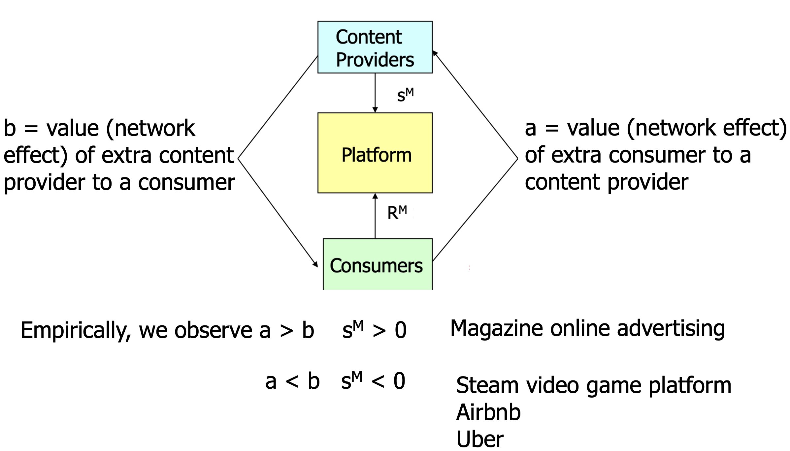
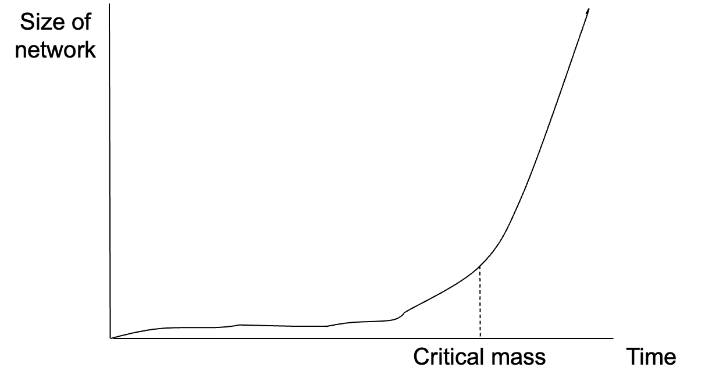
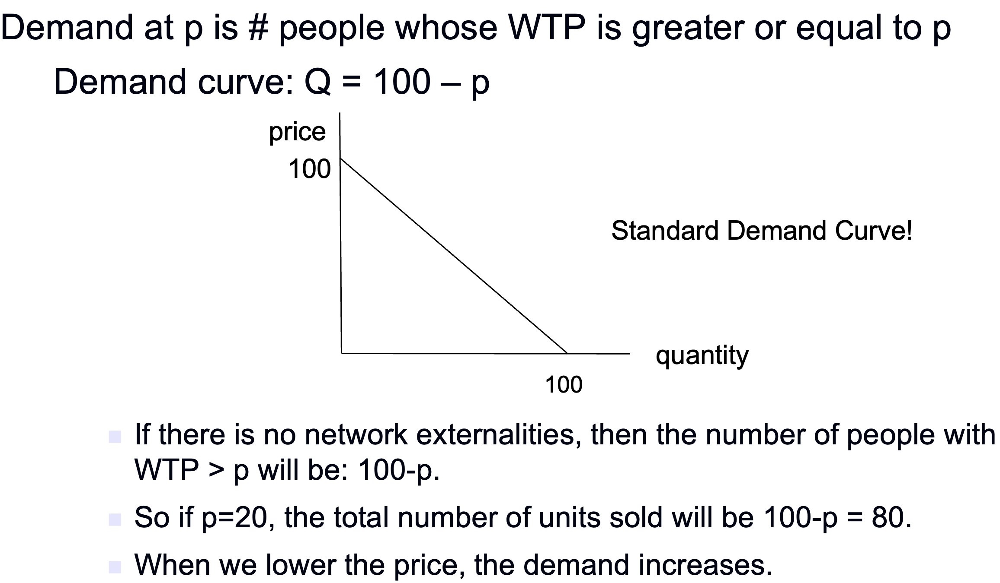
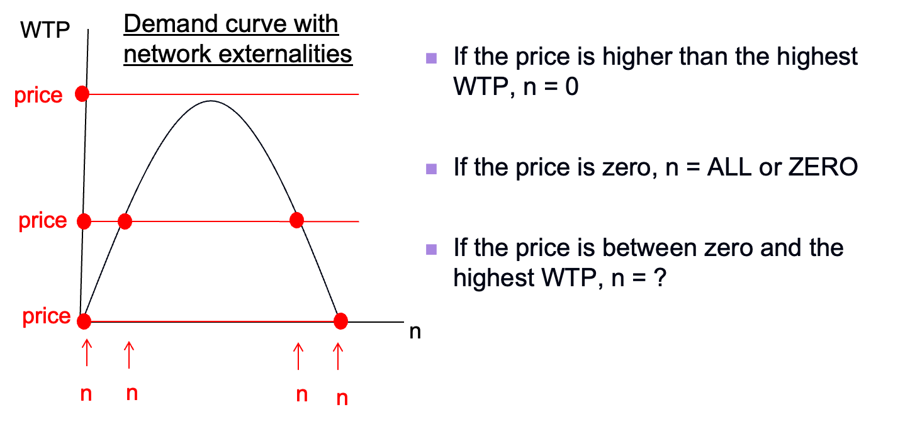
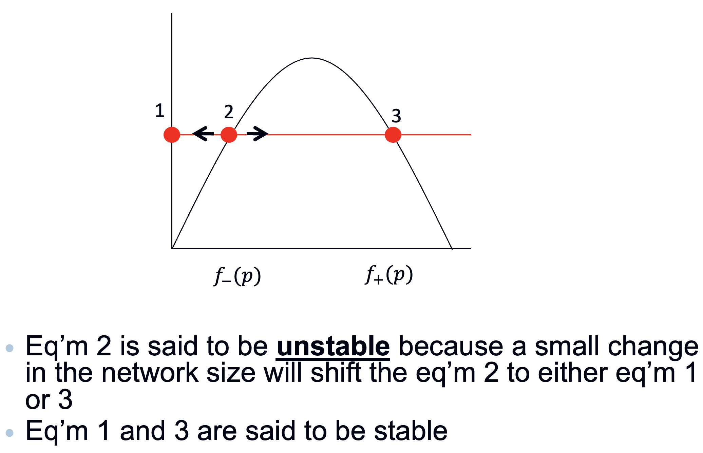
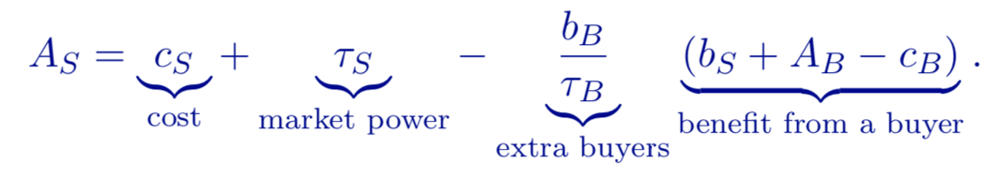
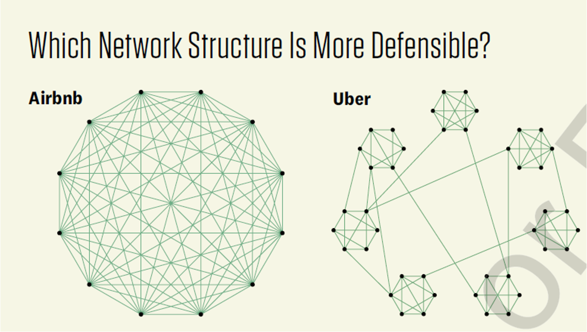
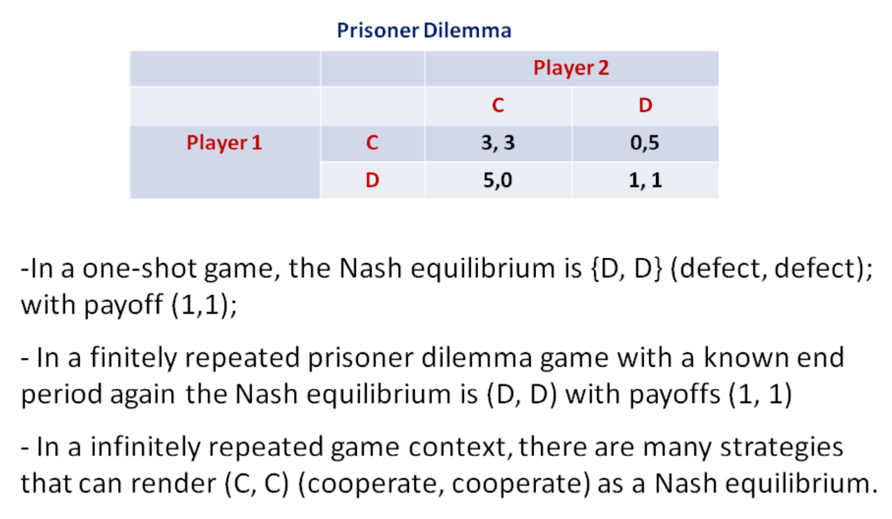
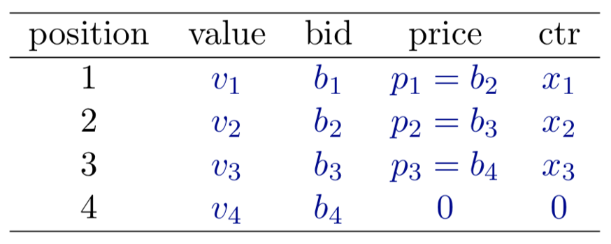
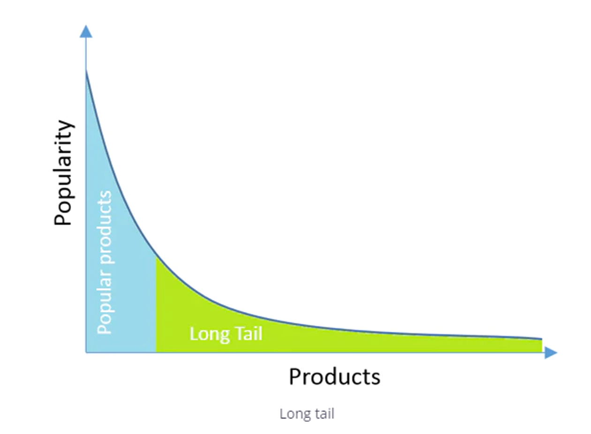

# Review: Platform Economics and Online Market

> 2025 年 M3 平台经济学复习笔记。基本题型只有不超过 10 个大题目，没有太复杂的证明，核心是在对知识点的理解和背诵上，也有对基本模型的拓展应用，可能类似于作业的题目，但不会有从 0 开始的证明题目。
>
> 接收到学长之前的考试经验，平台经济学的考试核心在于对概念的理解和记忆，一些比较复杂的推导在考试中并不要求。因此复习策略比较简单，就是把 PPT 全部梳理一遍，将其中的核心概念进行列举并反复记忆。同时结合学长提供的记忆单进行背诵。
>


## 1. Introduction

### 1.1 Definations

Platform brings together **different types of users** to enable economic or social interaction. A platform provides a way for two parties to enter into **mutually beneficial exchange or transaction**, platforms are matchmakers.

### 1.2 **Why are platforms taking over?** 

**Reason 1: network effects**

Platforms leverage network effects. Network effects mean that a user will pay more to connect to a larger network. Network effects create very significant inequality in sales and profits (**Winner-takes-most world**).

**Reason 2: Platforms usually have fewer employees and less fixed investment than traditional companies**

**Reason n: platform strength**

- **The focus is external**: A platform tries to bring together as many as possible from both (or all) sides, match them and create transactions. 
- Platforms disrupt traditional business

### 1.3 Role of platforms

**Four major roles of platforms:**

- **dealer**: buy from providers and resell to final consumers, brings together sellers and buyers and provides a substitute of directed trade (decentralized market). Uber, 滴滴, 高德, 亚马逊自营, Apple’s iTunes music store
- **pure platform operator**: provide platforms to allow sellers and buyers to interact. 购物网站, Airbnb, eBay, Amazon
- **infomediary**: an information gatekeeper which provides consumers with better information. 微博, 小红书
- **trusted third-party**: a certification agent which reveals product or reliability information. 支付宝, 安全认证

**How to set price ?**

A platform may collect from both sides (Airbnb)  or Collect from one side and subsidize the other (Amex). 定价的框架如下



### 1.4 Value of Platforms

**A simple model**

$v_H > c_H > v_L > c_L$ 的假设下画一个相交图，$v_L$ 和 $c_H$ 遇到后是无法交易的。Inefficiency comes from the matching friction (transaction cost)。对 Buyer 设定一个平台销售价格 $p_B$ 对 Seller 设定一个平台收购价格 $p_S$。将 $c_H$ 和 $v_L$ 赶出市场：$v_H - p_B \ge \frac{v_H - c_H}{2}$，$p_S - c_L \ge \frac{v_L - c_L}{2}$，同时又要保证 $p_B$ 尽可能高，$p_S$ 尽可能低，进而 $p_B = \frac{v_H + c_H}{2}$, $p_S = \frac{v_L + c_L}{2}$.  这样 $v_L$ 和 $c_H$ 都会推出市场，因为 $v_L-p_B<0$ 和 $p_S - c_H < 0$。这样只有 $v_H$ 和 $c_L$ 以及平台的交易中，达到了最优解，平台分利。

A platform that operates centralized exchanges may improve efficiency by sorting different types of participants.

**Further**

$v_H > v_L > c_H > c_L$ 本身就是最优均衡了，引入平台后 $v_L$ 和 $c_H$ 仍然会在平台下自由交易，这是和上面最大的区别，平台引入不会带来新的价值提升。

### 1.4 Dealer versus pure platform operators

**Model**

两种假设的模型推导下，得到的是相同的结果，profits 是 $\frac{1}{27}$。

Under our specification of uniform distribution, **a dealer platform and a pure platform operator obtain the same profits.** Moreover, the **optimal bid-ask spread (dealer) is equal to the transaction fee (pure platform operator)** and the trade volumes are the same.

但是这个结果并不是 General 的，是因为我们假设的均匀分布造成的。

**Conclusion**

哪种模式的利润或者销售量高是不确定的，平台可以根据自己的阶段转换角色

- If the platform acts as a dealer, trade is socially insufficient as the platform exerts monopoly power on both sides.
- If the platform acts as pure platform operator, sellers exert monopoly power over buyers, which yields high price but also high seller participation.
- In general, it is ambiguous under which role the platform makes higher profits and the transaction volumes are higher.

当然也有一些其他的因素导致 platform 选择的模式不同

- inventory **cost** of the platform,
- information **processing cost** of the platform,
- Information **asymmetry** between sellers and the platform


## 2. Network Effect

### 2.1 Introduction

**Network effects**, or network externalities are said to exist when the benefit that a consumer derives from owning a product increases when the number of other consumers of the product increases. 当拥有某种产品的其他消费者数量增加时，消费者从该产品中获得的效用也随之增加，也就是说个人获得的效用不仅取决于平台，还取决于使用平台的人数。

**Two types of network effects:**

- **Direct**: buyers form a network of users **who communicate with each other**. 我用了，会直接联系其他人一起用
  - Phones, Emails, Fax Machines, Operating Systems
  - DVD Players, Social Media, E-commerce and Games
- **Indirect**: the number of buyers of a good stimulates production of goods (supply side) that enhance the value of initial product. 买家多了 ⇒ 买家就会更多⇒ 买家获得更大效用
  - **Operating Systems:** more Windows users ⇒ more firms develop software ⇒ higher utility for Windows users. 
  - **Payment Cards:** 用的人多的话，Pos 机就多，用的人的效用就会很增加
  - **Shopping Malls**: more shoppers ⇒ more stores in the mall ⇒ higher utility to go there.
  - <font color="red">**Dating Agencies:** more males ⇒ higher male to female ratio ⇒ lower utility for males. (Negative)</font>

**Critical Mass**

The required network size for the network to take off. After reaching a certain scale, i.e. **critical mass**, the value offered by the network becomes really high for one or more user classes.



In practice, predicting the critical mass is very difficult:

- Diffusion within vs. across groups – targeting issue (不同的目标结果不同)
- Benefits from the size of the network – depends on product/service (不同内容效果不同)
- Competition from other networks/platforms – standard wars (竞争对手)

### 2.2 Demand Curve

和一般的需求函数可能只取决于所使用东西本身的质量不同，Network Effect 的需求曲线需要考虑使用的人数。How to create a demand curve when consumer WTP depends on how many people are using the product/service?

**Demand Curve without Network Effect**



**Demand Curve with Network Effect**

核心在于对 Utility 方程的重新定义，过程再次不再说明，直接给出结果 $p=100f(1-f)$ 和后续分析：



There is always a Nash equilibrium, in which nobody purchases the fax machine.（所有人都不参与，本身就是一个 Nash 均衡）；

在 Price 不为 0 的情况下不可能所有人都参与进来，也就是说 $f \ != 1$。

Price 在 0 和 1 之间的时候有三个均衡点，两边的点是稳定的，中间的点不稳定很容易向左右两边滑落



关于均衡点 2：

- Given a price, marginal individual’s WTP is higher than the price when the network size is in between $f_- (p)$ and $f_+ (p)$
- Individuals whose WTP is above the price will purchase, which forces the network size to converge to the eq’m 3.
- Similarly, if the network size is lower than $f_- (p)$ or higher than $f_+ (p)$, marginal individual’s WTP is lower than the price, which discourage customers to purchase.
- Conversely**, the zero-demand and high-demand Nash equilibria are stable**: after a small perturbation (or even a large one, here), the industry goes back to the initial equilibrium.

上述分析可以得到 Critical Mass:

- Threshold $f_- (p)$ is usually thought of as the **critical mass** of buyers which leads to the buildup of the network.
- Once the monopoly has reached this critical mass, the snowball starts rolling (in the right direction), and consumers demand converges to the high-demand equilibrium $f_+ (p)$.
- Sometimes, it may take a lot of time to reach the critical mass. Example: Fax machines in the U.S.

Solve the Optimal Price:

$Π(f)=P(f)×(100f)=10^4 f^2 (1 -f).$

This yields a price $p=100×2/9=200/9$ and profits $Π=4×10^4/27$.

**Which Equilibrium to Reach?**

平台肯定希望到达均衡点 3，但是这取决于很多的因素，不一定是能够自然达到的。However, as a company, you can create an **external “shock**” to the system in order to shift from one equilibrium to another. 后面要多多讨论公司的策略。

Firm’s Strategies: (这些 Strategies 都是很 make sense 很容易被想到的)

- **Penetration pricing / introductory pricing**: Set a low price until you reach the critical mass. 
- **Price discrimination**: give away your products to some consumers (say, households), and make other consumers (say, businesses) pay. 
- **Pirated software.** 盗版软件
- **Government intervention** is necessary sometimes to rule out the zero-demand equilibrium.

After Reaching Critical Mass

Once we’ve reached a critical mass, we are in a good position. But we might also have to work hard to keep it. 

### 2.3 Path Dependence

**If there is a better product, it may not actually win**, especially if it’s a bit late getting started. The eventual outcome may depend crucially on a small number of initial adoptions. **History** can play a big role.

VHS 的胜利是网络效应主导标准战争的经典案例。Ohashi 的模型表明，尽管 Betamax 在非网络因素（如音质）上占优，但 VHS 通过内容生态、价格策略和开放合作，放大了网络效应的权重（*ω*），最终突破临界质量。这一案例揭示了平台经济中“连接价值”对“产品价值”的超越，并为现代技术标准竞争提供了理论参考。


## 3. Platform Pricing

### 3.1 Some Puzzles

A night club allows women to enter free. But it charges men entrance fee. Youtube allows us to visit and see its content for free. But advertisers need to pay. 还有一些其他的收费现象，引出来的是一种比较奇怪的定价结构 **Asymmetric prices structure**.

### 3.2 Standard monopoly pricing

$$
\max_𝑝⁡(𝑝 − 𝑐)𝐷(𝑝), \\
(𝑝^∗− 𝑐)𝐷^′ (𝑝^∗) + 𝐷(𝑝^∗) = 0, \\
𝑝^∗−𝑐=−\frac{(𝐷(𝑝))}{(𝐷^′ (𝑝))}
$$

最终可以求解出来 $p^*$ 相对于弹性 $\epsilon$ 的函数
$$
\frac{p^*-c}{p^*} = \frac{1}{\epsilon}
$$
这说明传统的垄断定价只和弹性与价格相关，与其他的特征都无关！

### 3.2 Platform pricing

**Two-sided monopoly: transaction fees**

所谓 transaction fee，含义就是每次交易都要向买卖双方收取的费用。在这个地方需要注意的是，买卖双方的需求函数和对方的 utility 是高度绑定的。最终针对 transaction fee 而言的求解结果如下：
$$
𝑡_𝑖^∗+𝑡_𝑗^∗− 𝑐 =(𝑡_𝑖^∗)/𝜖_𝑖 , ∀𝑖 = 𝐵, 𝑆 \text{ and } 𝑗≠𝑖
$$
where $ϵ_i=-t_i^∗ D_i^′ (t_i^∗)/D_i (t_i^∗) $ is the price elasticity of demand of side $i$. Define total fee by $t=t_S+t_B$ and total elasticity by $ϵ=ϵ_S+ϵ_B$. We are back to the Lerner formula:
$$
t-c=t_B/ϵ_B =t/ϵ
$$
这个结果和上面的标准垄断是一样的。

**Two-sided monopoly: registration fees**

所谓 registration fee，含义就是一次性收取的费用。同样效用函数也和对方的数量多少相关，最终可以求解最优 registration fee 如下：
$$
(𝑟_𝑖^∗−(𝑐_𝑖−𝛼_𝑗 𝐷_𝑗))/(𝑟_𝑖^∗ )=1/𝜖_𝑖
$$
这一部分的分析很重要：

- Registration fee decreases when the price elasticity increases. 弹性大就需要降低注册费
- If the number of users on side $j$ is large, platform tends to subsidize the side $i$. $D_j$ 大了 $r_i$ 就会小。
- Recall that $α_j$ represents how much value that side $i$ offers side $j$. In other words, it is the importance of the side $i$ in the perspective of side $j$.  **If side $i$ can offer more value to side $j$, platform tends to subsidize the side $i$.**
- Prices tend to be **lower** compared to the case where network externality is not present. ($α_j=0$) 
- Registration fees can be **below marginal cost or negative** if the cross-group network externality $α_j$, $D_j$ is large enough. 

**Different pricing strategies**

- In video games 用户弹性大, **end users are subsidized**. Platform providers like Sony PlayStation and Microsoft Xbox price consoles at or below cost. Game developers pay a royalty to console manufacturers as much as 20% of a game retail price. 

  > Video game consoles users - typically teenagers - are **far more price sensitive than typical PC users**. 

  Making game consoles more affordable dramatically increased the value of console, shifting developer demand out and to the right. Here, game console subsidized consumers. **Profit lost on one side of market is less than profit gained on other side of market.** 补贴用户带来开发者的损失完全小于用户带来的收益。

- In the PC market 开发者弹性大, **end users are the money side**, paying well above cost. Application developers, on the other hand, pay no royalties and receive free software development kits from the OS vendors. 

  > PCs are often purchased for work and are otherwise more likely viewed as household necessities than game consoles are, so **price sensitivity** is lower. 

  Making System Development Toolkits (SDKs) free dramatically increased the value of operating systems, shifting consumer demand out and to the right. Here, Microsoft subsidized developers. **Profit lost on one side of market is less than profit gained on other side.** 补贴开发者带来的用户损失完全小于开发者带来的收益。

### 3.3 Divide-and-conquer 

**The launching stage**

Two-sided platforms often face a **“chicken-and-egg”** (**The Penguin Problem**) coordination problem（无法迈出第一步）:

- in order to attract buyers, the platform should have a large base of sellers, and vice versa.
- buyer are willing to join the platform only if they expect many sellers to join the platform too.

Problem arises when both sides hold pessimistic belief about the participation rate of the other side.

Possible solution: **Divide-and-conquer** (分而治之) pricing strategy: Subsidize one side of the market to get it on board and then use the presence of this subsidized side to attract the other side.

**Divide-and-conquer strategy**

For any $r_s>0$ and $r_B>0$ chosen in stage 1, sellers and buyers coordinate on the equilibrium which yields **the lowest payoff** to the platform. 

The detailed strategy: 分组后先用补贴吸引一部分弹性大的人，从另外一组人榨取更多资金

- divide group $i$: $r_i≤0$. (Subsidy side: attract users and grow network size)
- conquer group $j$: $r_j>0, j≠i$. (Money side: pay for the privilege of gaining access)

How it works ? 更难获取的一方被调动后，整个平台就活跃起来了

- Group $i$ gets surplus $-r_i≥0$ even no group $j$ agents join the platform. This is a **free meal** and they would like to join the platform.
- Given that group $i$ agents are on board, group $j$ agents would like to join if the $r_j$ is reasonable. The platform then charges $r_j>0$ to extract surplus from group j agents.

The coordination problem is more severe for those platforms at the launching stage: when a platform has established its reputation, the agents should not hold pessimistic belief about the other side’s participation.

**Demo: The Story of Acrobat Reader/Writer**

- Adobe Acrobat PDF reader is free while the Adobe Acrobat writer is not.
- Adobe first tried to sell PDF readers and writers but no one wanted to buy readers **when there was no content to read**. And, no one wanted to buy writers when no one had readers. Adobe broke the logjam by giving PDF readers away.

**Extension Thoughts**

In a traditional one-sided market, price depends only on **marginal cost** and **elasticity of demand**. 

But on platforms, pricing depends not only on the demand and cost from this side, but also on how their participation affects participation on the other side, and the profits associated with the other side, i.e., **the elasticity and the mark-up charged to the other side**. Identify the group that **creates large network effects** for the other group and the group that is more price-sensitive.

For a traditional one-sided market, we know that price should **drop when elasticity of demand is high**.

But in a two-sided market, you want to lower it even further. 

- The increased value extracted from the other side magnifies the value of having more consumers on the price elastic side.
- So often times, we see $p < mc$. 


## 4. Platform Competition

### 4.1 Standard competition models

**Bertrand competition**

Assumptions:

- 2 firms produce a homogeneous product (perfect substitutes) 很难完全同质
- Marginal cost = c for both firms 不同的公司边际成本一般不同
- Firms satisfy all the demand (i.e. there is no capacity constraints) 生产能力很难覆盖整个市场
- They **set prices** simultaneously (that is before observing the price of its rival) 现实可能有先后
- Consumers buy the product from the firm that offers the lowest price 有可能有偏向

The unique equilibrium is 
$$
p^*_i=p^*_j=c
$$
How to prove it? 在边际成本之上都可以降价，降价就可以增加利润，没有不降价的理由

Profit is 0? Why is it different from what we observe in the real life? 现实生活中很难满足如此多的假设，存在更多符合现实的情况

**Hotelling model of competition**

Assumptions:

- “Linear city” is the interval $[0,1]$. Consumers are distributed uniformly along this interval.
- There are 2 firms, located at each extreme who sell the same good. The unique difference among firms is their location.
- $τ$ is the **transportation cost**. This cost is up to the consumer to pay. If a consumer is at a distance $x$ to one of the sellers, its transportation cost is $τx$ . This cost represents the value of time, gasoline, or adaptation to a product, etc.
- Firms **set prices** simultaneously.
- Consumers buy the product from the firm that offers the highest utility to them.
- Consumers have unit demands, they buy at most one unit of the good $\{0,1\}$.

这个地方推导的核心在于找到对于 2 firms 的无差异 $x^*$ 然后分别让两个 firms 的 value 最高，求导就可以求解了。
$$
𝑝_1^∗=𝑝_2^∗=𝑐+ 𝜏
$$
对  $τ$ 还做了进一步的解释：An increase in $τ$ implies more product differentiation. Therefore, firms compete less vigorously (set higher prices) and obtain higher profits.

If the firms can choose their own locations, which are optimal locations for them? 价格竞争下，企业通过靠近对手减少消费者的运输成本差异，从而弱化价格竞争压力。

### 4.2 Platform competition

Consider the situation where multiple platforms are competing for users.

- **single-homing 单栖**: a user only joins one platform. 用户或供应商**仅在一个平台上活动**，不参与其他竞争性平台。
- **multi-homing 多栖**: a user joins several platforms. 用户或供应商**同时在多个平台上活动**，根据需求切换平台。

Possible configurations of users in platform-competition models.

- Both sides are single-homing.
- One side is single homing while the other side is multi-homing.
- Both sides are multi-homing. 

**Platform competition: single-homing**

Assumptions:

- There are two horizontally differentiated platform, 1 and 2.
  - There is a Hotelling line with length of 1. 
  - Platform 1 and 2 are located at the two ends.
- There is a unit mass of buyers and a unit mass of sellers.
- Each buyer or seller can at most join one platform (both sides are single-homing).
- Hotelling differentiation:
  - Both sellers and buyers are uniformly distributed on the Hotelling line. 
  - Hotelling transportation cost parameter: $τ_S$ for sellers and $τ_B$ for buyers.

Solution: 

求导之后的均衡如下：
$$
𝐴_𝑆=𝑐_𝑆+𝜏_𝑆−(\frac{𝑏_𝐵}{𝜏_𝐵} )(𝑏_𝑆+𝐴_𝐵−𝑐_𝐵)\\
𝐴_𝐵=𝑐_𝐵+𝜏_𝐵−(\frac{𝑏_𝑆}{𝜏_𝑆} )(𝑏_𝐵+𝐴_𝑆−𝑐_𝑆)
$$
先对这个中间等式做解析：



- when network externality is absent, Hotelling model will give $A_S=c_S+τ_S$.
- In the two-sided market setting, the price is adjusted downward by the factor $\frac{𝑏_𝐵}{𝜏_𝐵}(𝑏_𝑆+𝐴_𝐵−𝑐_𝐵)$
- The term $b_S+A_B-c_B$ represents the external benefit that platform $i$ gets by attracting an additional buyer.
  - First, platform $i$ makes profits $A_B-c_B$ when there is one more buyer joins.
  - Second, $b_S$ reflects the additional surplus that platform $i$ can extract from sellers when it has an extra buyer.
- Moreover, this benefit is adjusted by $\frac{𝑏_𝐵}{𝜏_𝐵}$ as one additional seller attracts $\frac{𝑏_𝐵}{𝜏_𝐵}$ additional buyers.

最终结果如下：其中 $𝑏_𝐵$ 是 Seller 给 Buyer 的网络效应
$$
𝐴_𝑆=𝑐_𝑆+𝜏_𝑆−𝑏_𝐵 \\
𝐴_𝐵=𝑐_𝐵+𝜏_𝐵−𝑏_𝑆
$$

- The side of the market which exerts larger externality tends to be subsidized. 更容易造成 Network Effect 的应被补贴
- The side of the market with little horizontal differentiation tends to pay low membership fee. 差异性越小定价越低

**Platform competition: multi-homing**

Under multi-homing, is the competition more fierce or less fierce? 显然是更激烈了

Under multi-homing, is it more or less likely to lead to “winner-takes-all”? 降低赢者通吃的可能性

Does multi-homing, compared with single-homing, have higher market efficiency? 效率的确更高！

**Extension**

- Big or small platform is more likely to accept interoperability? Small
- Congestion: negative same-side network effect 负面的网络效应可能带来拥挤



Aibnb 是全连接更稳固，Uber 则是按照地域连接很容易被切断（中国出现了 Didi）


## 5. Platform Launch

**Strategies to Overcome the Chicken-or-Egg Dilemma**

在第 3 章中，我们初步认识了 Chicken-or-Egg Dilemma 也理解了如何用定价的方式来破解问题，现在我们做进一步的探讨。

### 5.1 Subsidize users

**Fixed subsidy:** per user. Hourly payment guarantees, fixed bonuses for signup, referral subsidy. 

**Variable subsidy:** per interaction. Bonus on the supply side, discount on the demand side. 

### 5.2 Increase (perceived) value to new user 重要！

- Create standalone value. 创造独一无二的价值 (Operation system, phone)
- Start in niche market. 开启细分市场 (Facebook, Uber)
- Fill in one side (Taskrabbit, Taobao Tmall)
- Simulate users (Airbnb, weibo)
- Build hype 大肆炒作宣传 (Twitter, weibo) 

### 5.3 Decrease user adoption cost 重要！

- Compatibility: new platform compatible with the old ones. (可兼容性)
  - Playstation 5, Microsoft Windows OS, Taobao and Alipay 
- Offer tools or training
  - Microsoft, Intel offer development classes and kits. Uber offers help in driver licensing process. 

### 5.3 Dynamics of staging: which side first?

**Value dynamics 价值是不同的**

- Onboard **first those** who are less sensitive to the existence of the other side: LinkedIn（领英，雇主明显更敏感）MeiTuan (美团，用户明显更敏感)
- Onboard **simultaneously** if there is a lot of overlap in two sides: Etsy
- Onboard simultaneously if there is no standalone value: Nasdaq in 1971

**Cost dynamics 成本是不同的**

- Onboard first those who have low ongoing cost of staying on the platform: Meituan (restaurant 有较低成本，因此先被上线


## 6. Online Reputation

### 6.1 Information Asymmetries

**Reasons**

**Interacting with strangers.** E-commerce precludes potential customers from **inspecting goods prior to purchase**.  Online sellers tend to be newer firms/individuals and may have **less brand or reputation** capital to signal quality. **Sellers** (transaction partners) vary in terms of Skill, Effort, Ethics. These factors can create **information asymmetries** between buyers and sellers not present in off-line purchases. 

**Information Asymmetries**

- Asymmetric information 
- Uncertainty (symmetric incomplete information) 

**Adverse Selection** 逆向选择质量差的

- Defination: hidden characteristics / critical **prior to transaction**. Is a market situation where buyers and sellers have different information, so that a participant might participate selectively in trades which benefit them the most, at the expense of the other trader. 
- Examples: Akerlof's market for lemons. Job market. Health insurance
- Possible solutions to adverse selection: Screening (充分调查市场). Signaling (发送信号)

**Moral Hazard** 在被保护下做出肆无忌惮的做法

- Definition: Moral hazard can arise in any bilateral transaction, where an agent has the opportunity to deviate from the promised course of action, but where the action he takes is **hidden** such that he **doesn’t bear the full (negative) consequences/risk** of the action that he takes. 
- Examples: A person hired by a company (雇员); Museums asking for donations (募捐); Bailing out companies (救助公司); Paid sick leaves; Health insurance (健康保险); Renting a costume.
- Possible solutions to moral hazard: Monitoring (做好监管); Performance-based pay (根据表现定价); Reputation system.

### 6.2 Offline reputation system

**Information**

- More information to consumers is almost **always better**: economists and policy markers normally support policies to make more info available.
- In addition, when information is provided by firms it might affect their behavior as well. 

**Data**

In December 1997 LA County passed an ordinance requiring restaurants to display rating cards. 餐厅评级体系

- Demand at good places should go up or down? **UP**
- Demand at bad places should go up or down? **DOWN**
- Restaurants themselves might increase or decrease quality? (if the benefit exceeds the costs) **YES**
- Ratings reduce search costs for consumers. Competition will go up or down? **UP**

### 6.3 Online reputation system

Online reputation systems are online mechanisms that aggregate feedback from users past experiences, to enable **more informed decisions** of other users in the future. 

**Impact of Reputation Systems** 

- 增加价值：One study found that eBay buyers are willing to pay an 8% premium for buying from a seller who has 2,000 positive feedbacks and 1 negative feedback, compared to a seller with 10 positive feedbacks and no negatives. 
- 造成不信任：In another study, the researchers found that upon receiving his first negative rating, a seller’s weekly sales drop significantly, but that subsequent negative feedback has a much smaller effect. 
- 清理市场：The studies have also found that sellers are more likely to exit the market, the lower their reputation is. 

**Why Do Consumers Read Reviews?**

The main reasons given for accessing reviews are: 

- to ensure the product or service is **of good quality** (79%) 
- that the **product works** (61%) 
- to make sure they **don't get ripped off** (53%) 

**Why Do Consumers Write Reviews?** 

Motivations to post online reviews, are: 

- help others make **better purchasing decisions** (62%) 
- it is polite to leave feedback (35%) 
- want to share positive experiences (27%) 
- to help good vendors get business (25%) 

**Do Consumers Trust Reviews?** 

- Most consumers find reviews trustworthy, but only **13%** believe they are "very trustworthy" and a full **90%** believe that some people review products and services without trying them. 
- YouGov survey found that 21% of consumers have written reviews for products/services **they had never actually tried**. 
- A similar proportion (91%) believe companies write their own **positive reviews** and 89% think businesses **write negative reviews** about their competitors. 恶意抹黑

**Brand Reviews Across Industries**

The importance of reviews and advocacy is evident in every industry. 

- Online reviews are especially important for the **hotel/travel industry,** where over 80% of consumers find user reviews important. 酒店旅游业更重要
- Positive advocacy tends to be higher in industries whose products or services evoke consumers’ greater emotional involvement, such as smartphones, or in aspirational categories such as luxury cars. 能引起共鸣的行业中积极推荐比较普遍
- nIn contrast, negative advocacy tends to be much higher in service businesses, such as retail banking and mobile telecommunications: the reason is that any consumer facing interaction might lead to a negative experience, whereas a good product will usually remain satisfying. 服务业中消极的推荐则更为普遍

### 6.4 Reputation Systems 

The reputation-system introduces **intertemporal considerations**. Reputation causes people to take into account potential obstructions to their future trading-activity that are caused by receiving a bad reputation from malevolent behavior today. 

Reputation systems **alleviate the risk of observing morally hazardous behavior** by market-participants and, therefore, induces honest and trustworthy behavior. 

The reputation-system allows to clearly **distinguish benevolent sellers from malevolent ones**, reducing the potential for adverse selection. 

**Adverse Selection & Reputation Systems**

Reputation systems can be used to s**olve the adverse selection** problem by using **signaling mechanisms**. 

Remember that the goal is for the buyers to know the true quality of the goods that are in the market. 

Other users who have already bought the product have received a private signal about the products quality, i.e., they had the **chance to experience it and evaluate it**, and thus now have a better-informed belief about the products true quality.

By eliciting feedback from these users and sharing it with the community, the adverse selection problem can be addressed. 

**Moral Hazard & Reputation Systems**

Reputation systems can be used to address the moral hazard problem by using a **sanctioning mechanism**. 裁决机制

The idea is to sanction bad behavior by actors in the market. 

The reputation system can publish the history of actions of all agents, and can adopt the norm not to buy from agents who have repeatedly displayed bad behavior, or only at discounted prices. 拒绝与多次表现很差的人做交易

If the expected future losses from having a bad reputation is larger than the gains from cheating a few times, this provides the agents with an incentive to cooperate instead of to cheat. 利益受损大于短期获利那么就会注重 reputation 而作出正确选择

**Reputation Systems: Different Functions**

Depending on the particular domain, reputation systems can fulfill many different functions, including: 

- Trust-building: Reputation systems can encourage “good” behaviors and discourage “bad” behaviors. 
- Matching: Reputation systems can help to aggregate the most salient (重要) information about each product, making the selection easier for the users. 
- Promote quality
- Sustain loyalty (保持忠诚): Once a person or a product has a gained a particular reputation in one system, it is not easy to transfer or switch to another system. 

**A Simple Model of A Reputation System** 



- **Proposition:** In the group prisoner’s dilemma game with n agents, it is a Nash equilibrium for all players to play the grim-trigger strategy, for $δ ≥ 1/2$. 一旦贴现率大于 1/2 那么整个系统都会选择合谋 C 不会有人 D
- **Proof:** Assume that all agents except for one play the reputational-grim-trigger strategy. The agent considering the deviation faces the following decision problem: if he deviates once, all other agents will play D against him in all future founds. Thus, the analysis is the same as in the 2-player prisoner dilemma game above, which shows that for δ ≥ 1/2 , the agent is best-off to cooperate. 
- **Lesson:** There is strategic element in reputation building. To succeed, a reputation system should render cooperation (good behaviour) a dominant strategy. 

### 6.5 Methods to measure causal effect of online reviews

<font color="red">**已经搭建起 Reputation System 后开始考虑如何对这个系统做研究，真的有效果吗？**</font>

**Cross-sectional inference**

To measure the impact of online reviews ondemand of product $j$, if we run the following regression:
$$
\text{Demand}_j = \alpha + \beta* \text{Review}_j + \epsilon_j
$$
这种回归方式难以估计出准确的因果关系，因为内生性的存在 $\epsilon_j$ 和 $\text{Review}_j$ 并不是独立不相关的，因此 $\beta$ 大概率被高估。

**Panel data inference**

不同的时间可能有不固定的因果？那可以获取面板数据回归。When firms have data on demand and online reviews for various products over time, an approach that deals with some of the problem is one that **relies on panel data with fixed effects** at the level of the cross-sectional unit.
$$
\text{Demand}_{tj} = \alpha_t + \beta * \text{Review}_{jt} + \epsilon_{jt}
$$
**A/B tests**

当然这还是很有可能有内生性，那我们还可以仿照自然情况直接做实验。Randomly leave for a subset of products and then compare sales of these products with the sales of products which they did not leave review. 然后针对实验结果跑回归。
$$
\text{Demand}_{j} = \alpha + \beta * \text{Review}_{j} + \epsilon_{j}
$$
<font color="red">**更为细致的回归方法**</font>

**Natural experiments 自然实验是自然发生的政策或其他事件导致的数据差异**

Natural experiments rely on historical data that contain events that affect online reviews but are otherwise unrelated to demand. The purpose is to find the **exogeneous shock**. Difference-in-difference: comparisons of outcomes **shortly before and shortly afte**r the natural experiment.

> **Example:** Study the impact of user-generated microblogging content on the viewership of Chinese TV shows. 看微博评论对电视收视率的影响，发现其中有一段时间 WeiBo 突然被 Shut Down 了，正好是一次自然 (During the time period covered by the data, Sina Weibo was **unexpectedly** shut down for a brief period of time. The shutdown qualifies as a natural experiment)，做 DID 检验效果即可。

Other natural experiments:

- Merger of two review platforms (Lewis and Zervas, 2016).
- Change of methods to present the ratings. 
- Change of algorithms to calculate the scores. 

Limitation

- Hard to find, not standardized. (自然实验还是很少)
- Often yield context-specific estimates 
- Firms or individuals may anticipate the natural experiments and strategically adjust their behavior

**A/B tests 人为做实验修改变量验证效果**

Use information on any activity a firm might be able to leverage to **foster online reviews among its users**. **Indirect** manipulation of online reviews (操控 review 做到 A/B Tests). **Peer encouragement.** E.g., a targeted advertising campaign to users that provided positive reviews in the past.

> **Exapmle:** Eckles et al. (2016) randomly alters the Facebook interface of some users such that they become more likely to provide feedback (e.g., likes) to other users in their network. They then study the impact of the altered feedback behavior of the affected users on the behavior of their peers. 最后发现修改界面的人的朋友点赞数量也增加，这表明社交反馈具有传染性。

Advantages: Scalable; Downside: Hard to find interventions that affect online reviews without also directly affecting demand.

**Regression Discontinuity 断点回归**

Platforms have two scores: the underlying **continuous score** and a **star rating** (rounded to the nearest half star). Some platforms only present to consumers the rounded star rating (or only make it prominent). The rounding generates a **discontinuous jump** in the perceived rating (因为取整导致了跳跃) .Those products near the rounding threshold are likely to be similar except for their rounded star ratings. Hence, the causal impact of the star ratings can be obtained by comparing demand for products **marginally above and marginally below** the rounding threshold. 

Advantage: Scalable; Limitation: Only applicable to platforms which round the star ratings; Only suitable for analysis of valence, not number or content of reviews.

<font color="red">**目前已经被证实的一些结果**</font>

**Review Valence (评论等级)**: Average ratings are most studied aspect of the online reviews. Research find that they have a substantial causal impact on demand, though the magnitude of this effect varies by timing and context. 

**Review volume (评论量)**: are typically displayed prominently next to average ratings, and consumers can also use them to infer quality. Increases in review volume could lead to increased demand.

**Review Content (评论内容)**: is inherently high dimensional. Most analyses of review text rely on a pre-processing step that transforms text into a small number of variables.

> Ghose and Ipeirotis (2011) study the text of travel reviews and find that objectivity and readability are **correlated with higher product sales.** 
>
> Ludwig et al. (2013) show that positive and negative affective content (e.g., words such as “love” and “hate,” which are detected using LIWC) are **positively associated** with conversion rates. 
>
> Packard and Berger (2017) find explicit endorsements (“I recommended this book”) are **more persuasive than implicit endorsements** (“I enjoyed this book”). 
>
> Kupor et al. (2017) find product endorsements that contain **typographical errors** are perceived as more authentic, thus enhancing their persuasiveness. (有排版错误的评论更有说服力)

**Moderators of the relationship between reviews and demand (存在修正)**: Impact of reviews depends on consumers’ prior information. Reviews are not the only information source available to consumers, and thus they affect demand only to the extent that they provide new information. 影响主要来自于新增的信息

> 对于品牌连锁店，评论造成的影响很小，因为从评论中能获得的额外信息不多。Luca (2016) finds that Yelp ratings **do not impact the revenue of chain restaurants**. Lewis and Zervas (2016) show the impact of TripAdvisor ratings is much **smaller for chain-affiliated hotels** than for independently operated properties. 

**Timing**: Babic et al. (2016) show that **early reviews are more important** than recent reviews in driving the sales of new products.  

**黑红也是红**: Review platforms can help consumers discover new products and services they were not aware of. Berger et al. (2010) show that even negative reviews can have a positive impact on demand when they cause a sufficient increase in consumer awareness.

**Effect of online reviews on pricing and advertising**: Houser and Wooders (2006) find that on eBay, seller’s reputation has an economically and statistically **significant effect** on price; Lewis and Zervas (2016) use TripAdvisor data to show that hotel prices **increase** in response to online ratings; Hollenbeck et. al (2019) find that on TripAdvisor, hotels with higher ratings **spend less** on advertising than hotels with lower ratings. 

### 6.6 Design of online reputation system

<font color="red">**一个现实中的 online reputation system 该如何设计？**</font>

How Should An Ideal Reputation System Work? It should yield:

- High correlation between “reputation scores” and “true scores”.
- Or high correlation between “reputation scores” and future seller behavior.
- The system should be manipulation-proof towards any kind of malevolent action. (不会有任何的恶意操控)
- The system should measure and reliably display the trustworthiness of market-participants. (能够可靠显示市场参与度)

**细节决定**: In the real-world, the design of reputation systems must take into account many **different aspects of the particular domain**, and the devil is often in the details. Over the last few years, a group of market design researchers have studied the reputation system in detail, run experiments, ultimately changed the design, and studied the consequences of their change. 

<font color="red">**一个现实中的 online reputation system 该如何设计？**</font>

**What information to present?**

- Which actions are most relevant to the reputation system’s users?
  - To decide whether a seller is **honest**
  - To help users determine whether a reviewer has **similar tastes** to their own
- Which behaviors are desirable?
  - Want more posts or higher quality of reviews
- For which behaviors can one obtain reliable information?
  - First hand (internally generated) vs second hand (from others) feedback

**How to Aggregate and Display?**

- The extent to which the reputation mechanism **makes a judgment** versus allowing users to **make their own judgments**.
- The extent to which the presence of the reputation system can create **competition** among users.

*Way 1.* Raw activity statistics. E.g., # reviews posted, # transactions completed

- Most neutral method, 这是最中立的方法, 既有优势又有劣势
- Advantage: allows users to draw their own conclusions
- Disadvantage: users must be familiar enough with the environment to draw the proper conclusions. 

*Way 2.* Scores and distinctions. E.g. star ratings, numerical scores, levels, achievement

- Advantage: directly communicate to users whether somebody’s performance is good or bad
- Attention: Best in settings where there is a commonly agreed upon notion of what “quality” means. 

*Way 3.* Leaderboards and relative rankings

- Advantage: Increases incentives to contribute 
- Disadvantage: Instills a culture of competition (might be disruptive). Manipulative; Churn 

*Way 4.* Display a user’s entire history vs. recent behavior only. 

- Displaying entire history. 
  - Pros: helps build loyalty; 
  - Cons: not good for incentivizing continued contribution for seasoned users, and discourage new members from joining.
- Displaying recent behavior. 
  - Pros: gives newcomers equal opportunities; 
  - Cons: reduce the cost of moving to a competitor’s website

<font color="red">**Common problems and solutions**</font>

**Not enough reviews**

While most people read reviews to inform a purchase, only **a small fraction** write reviews on any platform they use. Strong network effect makes it worse. Solutions:

- **Seeding reviews 找代写的人**: hiring reviewers or drawing in reviews from other platforms. **Pros**: useful in the early stages; **Cons**: costly; differ from organically generated content.
- **Offering incentives 给激励**: motivate (financially or non-financially) your platform’s users to contribute reviews and ratings. **Pros**: simple and direct. **Cons**: costly for a large product array. could backfire (可能会适得其反).
- **Pooling products 一评多用**: by reconsidering the unit of review, you can make a single comment apply to multiple products. **Pros**: useful as your product space broadens. **Cons**: may fail to give your customers the information they need about any particular offering.

**Selection bias**

Research finds that consumers tend to leave a review only when their experience is **very good or very bad.** **Selection bias**: might not accurately represent the full range of customers’ experiences of the product. 只有非常好和非常坏的评论，因为只有感受很好或很坏的人才会有动力评论。

Example: eBay’s inflated online ratings in 2011. Thus eBay reformulated seller scores as **the percentage of all of a seller’s transactions** **that generated positive ratings** (instead of the percentage of positive ratings, why? 只有真正交易的人才能评论). 

Solutions:

- **Require reviews 强制评论**: requires users to review a purchase before making another one. **Pros:** simple; **Cons:** consumer churn 用户流失; noninformative review by using the default review.
- **Allow private comments 私下评论**: allow users to leave feedback that only the transaction partner could see.
- **Design prompts carefully 尽可能为评论者思考, 让其更好评论:** thoughtfully design different aspects of the environment in which users decide whether to review. 在写评论的时候不同的提示词下, 用户撰写的评论长度可能就有影响

**Whitewashing** 

An agent simply exits the system once he has a bad reputation, creates a new identity, and starts with a blank slate. This is particularly **easy** in many online domains where users only have pseudonyms, and thus nothing prevents them from whitewashing. Whitewashing can render the grim-trigger strategy ineffective! 毫无成本的洗白让犯罪风险很低, 评分无用

Solutions:

- **Require unique identities.** Cons: would severely limit registration numbers.
- **Require an initiation fee upon entry.** If the fee is chosen to be large enough, compared to the payoff the user receives from defecting and running down his reputation profile. 让注册费有威慑效果
- **Force new player to “pay their dues”.** The idea is to favor agents that have been in the system longer, or equivalently, to punish newcomers a little bit. 待的时间越长相对优惠越大

**Fraudulent Reviews**

Sellers sometimes try (unethically) to boost their ratings by leaving positive reviews for themselves or negative ones for their competitors. 很多商家会对自己的产品进行虚假评论从而引流。

Solutions:

- **Set rules for reviewers 设定规则:** decide who can review and whose reviews to highlight. **Cons:** may reduce the number of genuine reviews and reviewers. 可能就会减少数量了
- **Call in the moderators :** moderation can eliminate misleading reviews on the basis of their content. 请人帮忙做调整 (Employee, Community, Algorithm).

**Reciprocity**

Studies found a high degree of **reciprocity** between feedback from two traders involved in the same transaction. **Reciprocity（互惠性）** 指用户之间因相互评价行为而产生的策略性互动倾向，即一方对另一方的评价可能引发对方的对等或反向回应。这种行为可能表现为正向的“礼尚往来”（如积极评价引发更多积极评价），也可能表现为负向的“报复性反馈”（如差评引发更极端的负面回应）.

**Solutions - Simultaneous reveal:** feedback is only made public either after both traders have submitted their feedback, or after a fixed number of days has expired such that no more feedback giving is possible. 

- Pros: removes the possibility of conditioning the feedback on the feedback of the trading partner.
- Cons: might diminish the **frequency of feedback** giving overall, in particular, the mutually satisfactory feedback.

### 6.7 Firm strategies for Reputation System

<font color="red">**Trends and innovations 一些有关信誉系统的创新趋势应用**</font>

**Convenience** 追求更加便利

- **ultra-aggregation:** Sites which gather reviews on various businesses and/or industries. 将评论聚合起来方便查看
- **meta reviews:** Innovative tools offer companies to monitor reviews from **all over the web**, while providing **meta-data** which analyzes authentic reviews, for the end-user. 提供原数据 “Meta-Reviews are a trusted summary of relevant reviews worldwide, showing the most talked about and most relevant attributes of a particular hotel, along with some special, important-to- know ‘nuggets’ of information that are unique to the particular hotel.” 
- **search integration:** Shoppers usually use reviews as part of their shopping journey. So search engines strive to integrate reviews through the search engine.

**Personalization** 追求更加个性

- Amazon offers a “Shop With the Help of Your Friends” program. Users connect their Amazon account with their Facebook account to join. 社群化
- In 2012, TripAdvisor launched an app for Facebook, a way for hotel owners to pad their Facebook Pages with reviews, ratings, photos, and other content. 个性 APP

**Trust: everything is reviewable**

Grocery retailers and hypermarkets, are also incorporating online reviews, in order to drive sales and reduce online shopping barriers. 线下的平台也开始引入评分，目的就是搭建信任。

**Interaction: real-time feedback**

Mobile tools provide a way to post a review immediately upon receiving the service. 伴随体验及时回复

**Multi-channel, Multi-format**

Online reviews take many forms, and marketers should try and monitor those most important to their category. Review aggregators have evolved over the years: 起初只有评分，后续有了推荐甚至可以上传视频。

<font color="red">**Firm strategies**</font>

Today, companies acknowledge that shoppers share and read online reviews, and instead of viewing that fact as a threat, they try and turn it into an opportunity, by: 

- Hosting the reviews in their own websites
- Encouraging the user to a review aggregator for reading / writing a review
- Using positive reviews in their marketing communications (用评论做宣传)


## 7. Online Advertising and Position Auction

### 7.1 Introduction

An Internet user enters a search term (query or keyword) into a search engine. He gets back a page of results containing both links **most relevant to the query** (i.e., organic links) and the **sponsored links** (i.e., paid advertisements).

**Two types of fee structure**

- Pay per impression: When a user **sees** sponsored link, the advertiser then pays the search engine.
- Pay per click: When a user **clicks** on the sponsored link, the advertiser then pays the search engine for sending user to its Web page. 

The number of ads that the search engine can show **is limited**. Different positions on the search result page have different desirabilities to advertisers (the top slot will receive the largest number of clicks and hence most attractive). Using Auction (**Generalized second-price (GSP) auction**) to sell position.

### 7.2 **Brief history of position auctions** 

**Pre-1994: advertising sold on a per impression basis, traditional direct sales to advertisers.** 

- Advertisers paid **flat fee** to show their ads a fixed number of times (typically, 1,000 showings or “impressions”).
- Contracts were negotiated on a **case-by-case** basis, but the minimum contracts were large (a few thousands per month). 

**1994: Overture (formly GoTo.com) allows advertisers to bid for keywords**

Offering some amount **per click**. It was first company to use pay per click payment structure. 

**Late 1990s: Yahoo! and MSN adopt Overture. They started to use generalized first price auction**

- Advertiser could target their ads: instead of paying for a banner ad, they could specify keywords.

- Ads links are shown in descending order of bids (**similar to** **first-price auction**).

- **Unstable:** advertisers constantly change bid to avoid paying more than necessary. GFA 是不稳定的

  > Why unstable? 首先我们要确定什么是 stable 的均衡，就是给定其他条件的情况下，变量没有变化的动机。现在给一个 GFA：
  >
  > Example: Two slots and three advertisers.
  >
  > - the first slot receives 200 clicks while the second receives 100. 
  > - advertiser 1, 2, and 3 have value per click of $10, 4 and 2 respectively. 
  >
  > If we use generalized first-price auction, does a pure strategy equilibrium exist?
  >
  > ```ABAP
  > 不存在稳定的均衡.
  > 假设: 1 出 10 , 2 出 4 , 3 出 2.
  > 那么在 2 和 3 出价不变的情况下, 1 有改变自己价格的倾向: 减少到 4.1
  > 此时在 1 和 3 出价不变的情况下, 2 有改变自己价格的倾向: 减少到 2.1
  > 所以不会稳定
  > ```

**GSP**

2002: Google introduced its own pay-per-click system, **AdWords**. Yahoo! and MSN also switched to this **generalized second-price** (**GSP)** system. 

- for a specific keywords, advertisers submit a bid **stating their maximum willingness to pay** for a click. 
- the search results will be shown **in decreasing order** of bids. 出价越高的广告在越显眼的位置.
- If a user click on an ad in position i, that advertiser is charged by the search engine an amount equal to the **next highest bid**, i.e., the bid of an advertiser at position i+1. 广告位置的单价以紧邻更低的价格为准

> Example: Two slots and three advertisers. The first slot receives 200 clicks while the second receives 100. Advertiser 1, 2, and 3 have value per click of $10, 4 and 2, respectively.
>
> Generalized second-price auction
>
> - suppose everyone reports truthfully, then bids are \$ 10, \$ 4, and \$ 2.
> - payments will be \$ 4 and \$ 2.
> - Is this an equilibrium ?
>
> ```ABAP
> 这是一个均衡!
> 在 2 和 3 出价不变的情况下 1 没有改变价格的倾向
> 在 1 和 2 出价不变的情况下 3 没有改变价格的倾向
> 所以很稳定
> ```

Features:

- Tailored to the unique environment of the market of online ads. 根据市场环境独家定制
- Dominant transaction mechanism in this large and rapidly growing industry.
- Most of Google revenues comes from GSP auctions. (for Yahoo!, over half)  

### 7.3 Basic setting of position auction

There are $N$ advertisers: $a = 1, 2,\cdots, N (N > S)$.

There are $S$ slots: $s = 1,2,\cdots,S$.

- If $S=1$, then it is **standard second-price auction**
- If $S>1$, then it is **generalized second-price auction**

The slots closer to the top receive more clicks. Higher position yields higher **click-through** **rate**: $x^1 >x^2,\cdots>x^S$.

Expected profit per click-through: $v_a > 0$. Expected profit to advertiser $a$ from appearing at slot $s$: $u_a^s = v_a * x^s$. 最终的单价由 bid 出的价格决定 $p_s = b_{s+1}$.

Example with N = 4 and S = 3:



### 7.4 Standard second-price auction

前面的基础设定就不在此赘述了，直接上最终结果: In the standard second-price auction, it is a weakly dominant strategy for bidder $i$ to bid exactly his true value $v_i$ (Truth-telling). **Standard 的最优结果一定是 bid truthfully.**

A player’s weakly dominant strategy is a strategy that yields him weakly higher payoff no matter what his rivals choose. We prove this argument using **2 steps:**

- $b_i = v_i$ weakly dominates bidding any $b_i < v_i$. 

  > Consider a bid $b_i = x < v_i$.
  >
  > - Suppose $\max b_{-i} > v_i$. **Both bids, $v_i$ and $x$, will lose**. The payoffs are the same.
  > - Suppose $x < \max b_{-i} < v_i$. **Bidding $v_i$ will win while bidding $x$ will lose**. Bidding $v_i$ yields positive payoff $v_i - \max b_i$ while bidding $x$ yields payoff 0.
  > - Suppose $\max b_{-i} < x$. **Both bids, $v_i$ and $x$ will win**. Both bids yield payoff $v_i - \max b_{-i}$.

- $b_i = v_i$ weakly dominates bidding any $b_i > v_i$.

  > Consider a bid $b_i = x > v_i$.
  >
  > - Suppose $\max b_{-i} > x$. **Both bids, $v_i$ and $x$, will lose**. The payoffs are the same.
  > - Suppose $v_i < \max b_{-i} < x$. **Bidding $v_i$ will lose while bidding $x$ will win**. Bidding $v_i$ yields payoff 0 while bidding $x$ yields a negative payoff $v_i - \max b_{-i}$.
  > - Suppose $\max b_{-i} < v_i$. **Both bids, $v_i$ and $x$ will win**. Both bids yield payoff $v_i - \max b_{-i}$.

### 7.5 Generalized second-price auction

In a GSP position auction, **bidding truthfully (bid his true value) is not necessarily a dominant strategy.** 

Example1 :

- Three bidder and two slots, with 200 and 100 clicks. 
- Consider a bidders with value 10. 
- If the other two bidders bid 8 and 4. will he bid truthfully?

```ABAP
这种情况下 truthfully 出价不是最优的，而是出在 8 - 4 区域中
```

Example 2 :

- Three bidder and two slots, with 200 and 100 clicks. 
- Consider a bidders with value 10. 
- If the other two bidders bid 8 and 6. will he bid truthfully?

```ABAP
这种情况下 truthfully 出价则是和 8 - 4 区间无差别的
```

因此 GSP 的求解就比较复杂，且没有固定答案。简化的方法是使用 A symmetric Nash equilibrium set of prices (SNE) 来进行优化。

### 7.6 Case study: online ads and Google

**Three Drivers Behind Increased Online Ad Spending**

- Increasing user time online
- Improved measurement  & accountability
- Targeting

**Pricing Model**

- **Cost per thousand (CPM):** Advertiser pays for every thousand times an ad is displayed (Magazine advertising).
- **Cost per action (CPA):** Advertiser pays each time a person does something (sale, registration, etc.) (Car Insurance Quote).
- **Cost per click (CPC):** Advertiser pays each time a Web site visitor clicks on an ad (Google).

**AdWords**

- Advertisers specify the maximum CPC they are willing to pay.
- The rank of ads based on both **maximum CPC** and **the quality of advertisers’ web pages**. (不仅看钱还看质量)
- Actually pay just one cent more than the second highest bid.

**Success of Google**

- Google’s trick is “matchmaking” — matching advertisers to right audience.
- Pull (instead of Push) Advertising (根据兴趣分发, 而不是强推)
- Pricing Method (CPC instead of CPM)
- Selling Strategy (Auction instead of fixed prices)
- Ad Networks (AdSense)


## 8. Recommendation System

### 8.1 Introduction

Recommender Systems are software tools and techniques **providing suggestions for items** to be of use to a consumer.

The goal of automated recommendation engines, or recommender systems, is to estimate **how highly a user would rate an unseen product**

- based on ratings provided by this user on other products
- based on ratings provided by other users
- ultimately recommend a product or set of products. 

**Recommendation System is really important** (大量的收益都来源于此)

- 35% of the purchases on Amazon are the result of their recommender system, according to McKinsey.
- 75% of what people are watching on Netflix comes from recommendations, according to McKinsey.
- Employing a recommender system enables Netflix to save around $1 billion each year

**Core Target**

Support users in various decision-making processes, such as what items to buy, what music to listen, or what news to read, cope with **information overload** / abundance of choice. Recommender systems has the **potential to lower search costs** - a key function of multi-sided platforms. 

**What are the needs**

To be useful, a recommender system needs to have some information about a user’s own preferences. 

- Explicit Ratings: The user actively **rates items** (e.g. as on Netflix) 
- Implicit Ratings: The system infers ratings based on the **user’s behavior** (browsing and purchasing behavior on Amazon.) 

User’s profile: information on user’s age, gender, location and so forth. 



正上图所示，Popular Products 拥有大规模的 popularity，因此数据更容易获得，也就更容易被精准推送。

**Example 1. Netflix**

Finding content is a non-trivial challenge on Netflix, given the massive amount of content, making a recommender system an extremely important component of their business model. Estimate a utility function that automatically predicts how a user will like an item, based on Past behavior, Relation to other users, Item similarity & Context.

**Examples 2. Amazon** 

Amazon’s “**Like**” option enable users to provide a binary feedback signal, allowing personalized recommendations based on the books (items) a user Likes. In addition to these **explicit ratings** (via the Like button and purchases), Amazon also takes a lot of **implicit information** into account, in particular the user’s **viewing** and **browsing** behavior. 根据是否喜欢以及国王的浏览记录

**Examples 3. Pandora** 

When a user first visits Pandora, the user create your **first “radio station.”** For this, she enters her favorite song or artist, at which point Pandora creates a (personal) radio station based on the user’s taste.

### 8.2 Content-based Filtering

Based on **a description of the item and a profile of the user's preferences**. 编码货物和用户信息做比较后进行推荐。

**Assumption**

People who agreed in the past will agree in the future, and that they will like similar kinds of items as they liked in the past. These methods are best suited to situations where there is known data on an item (name, location, description, etc.), but not on the user. Usually used in social media.

**Problems**

- do not provide any mechanism for evaluating the quality or popularity of an item. 需要评估质量，但却没建立任何机制
- items must include some form of content that can extract feature by algorithms. 有的内容根本无法提取特征

### 8.3 Collaborative Filtering

Items are recommended to customers based on the interests of a community of customers, **without the analysis of items’ content**, also be called the social recommendation system. 无需分析 item 的内容, 只需要对人的特征进行比对即可。

**Assumption**

People who behave similarly in the past will continue to buy similar products in the future, items that were rated highly by one group customer will be recommended to similar customers in their “community”. The system takes all users’ ratings into account in making a recommendation.

**Method**

Currently one of the most frequently used approaches and usually provides better results than content-based recommendations.  **Methods to measure user similarity or item similarity**: the k-nearest neighbor (k-NN) approach and the Pearson Correlation.

**Problems**

- **Cold start 冷启动, 刚开始消费行为不多无法比较**: For a new user or item, there isn't enough data to make accurate recommendations. Can be alleviated by asking users for other type of data at the time of sign-up (gender, age, interests, etc), and using meta information from the items in order to be able to relate them to other existing items in the database.
- **Scalability 规模太大, 指数级增加算力**: there are millions of users and products. Thus, a large amount of computation power is often necessary to calculate recommendations.
- **Sparsity 稀缺性, 商品无评分**: The number of items sold on major e-commerce sites is extremely large. The most active users will only have rated a small subset of the overall database. Thus, even the most popular items have very few ratings.
- **Not suitable for unusual tastes:** since the collaborative filtering recommendation system relies on the community of “similar customers”, it is poorly suitable for providing recommendations to customers who have unusual tastes.

**Solutions: Hybrid Method**

- A content-based approach would **come in handy after the users start interacting**, or you could ask them explicitly about their interests to help you at the beginning. 
- Once the volume of users and interactions increases, it's time to **start contemplating a collaborative-filtering approach** to augment the potential of your system.

### 8.4 Impact

**How to Evaluate the Performance ?**

- **Online methods**: (A/B testing), user reactions are measured given the recommendations made. For example, you can measure when the user clicks on the recommended items — as well as the conversion rate — and evaluate the direct impact of the system. 
- **Offline methods**: the system doesn’t have to be deployed. The data is split into training and validation datasets, which means that part of the data will be used to construct the system and the other part to evaluate it. 

**Example 1: Amazon’s Item-to-item Collaborative Filtering 构造 item 相似集群**

- Rather than matching the user to similar customers, item-to-item collaborative filtering matches each of the user’s purchased and rated items **to similar items**, then combines those similar items into a recommendation list.
- The algorithm builds a similar-items table by finding items that customers tend to purchase together. We could build a **product-to-product matrix** by iterating through all item pairs and computing a similarity metric for each pair.

**Example 2: Taobao’s Tree-based Deep Model 层层递进，层层深入，先生成小的集合再逐步扩大**

- Matching: after receiving page view request from a customer, the system uses user features, context features, and item features as input to generate a relatively **smaller set of candidate items** from the entire corpus in the matching server.
- Ranking: With hundreds of candidate items, the real-time server uses more expressive but also more time-consuming models to predict indicators like click-through rate or conversion rate. After ranking by strategy, **several items** are ultimately impressed to each customer.

**What do companies say:** 

- Netflix: 2/3 of the movies watched are recommended.
- Google news: recommendations generate 38 % more click though.
- Amazon says 35 % of product sales result from recommendations.

**OK Cupid experiment** 考虑两个维度，**实际的匹配率**以及**显示给用户的匹配率**

不管是实际的匹配率还是呈现给用户让用户相信的匹配率都能带来消费的增加。Similarly, Adomavicius et al. (2018) find that randomly generated ”recommendation ratings” on an music app significantly affect consumers’ willingness to pay. 

**Dark side of recommendation system**

- They can manipulate preferences in ways consumers don’t realize. 掌控消费者的喜好
- Fresh means to exert market power. 驱动市场
- Privacy and consumer protection issues. 隐私泄漏
- Filter bubbles and echo chambers. 信息茧房，与外界隔离


## 9. Sharing Economy

### 9.1 Three drivers

**Economic drivers**

- Rising costs of production 成本高
- Desire to maximize resource utilization 物尽其用
- Consumer interest in developing new sources of income through freelancing 自由职业开发新收入来源

**Technological drivers**

- Mobile devices
- Social networks
- Sensors (enabling the “internet of things”) 
- Payment systems 

**Societal drivers**

- The desire for an independent lifestyle
- Public concern about environmental and community sustainability

### 9.2 Peer-to-peer sharing

Individuals can share their underused goods (e.g., room, car, office space) with their peers through **a sharing platform**.

- Also called collaborative consumption
- Short-time sharing
- Economic and socializing incentive

**How will emergence of sharing economy affect people’s purchase?**

- On the one hand, people have an alternative option for buying. They may purchase less, but rent/share more.
- On the other hand, existence of sharing market gives people incentive to buy products and share them out, in order to gain extra income. 

**How will emergence of peer-to-peer sharing affect price and revenue of traditional markets?**

Sharing economy may intensify the competition and undermine the price and revenue of competitors (Airbnb vs. hotels). 

**Result: Market clear** 市场出清

- In each period, some consumers may rent out their purchased products while others may rent a product from the product-sharing market. 
- In equilibrium, the supply and the demand for product sharing will be equal.
- In each period $𝑗$, there will be a market-clearing price ($p_j$) that works to match the supply and demand.

When the firm strategically chooses its retail price, consumers’ sharing of products with **high marginal costs** is **win-win** for the firm and the consumers whereas their sharing of products with low marginal costs can be lose-lose. 共享边际成本高的是双赢，边际成本低的是双输

### 9.3 On-demand service

Connects waiting-time-sensitive customers with independent service providers. 

<font color="red">**Matching in on-demand service**</font>

**First-dispatch protocol** 首次调度

- In the first-dispatch protocol, only open drivers are considered as dispatchable. 
- Each request is immediately assigned to the open driver who is predicted to **have the shortest en route time**. 

但是这种调度方法可能**不是最优的**，因为在调度过程中可能还会出现新的更优的单子。

**Batching** 批量调度

Requests are collected for a short time window (e.g., a few seconds). Then an optimization problem is solved to pair each request with an open driver. If there are riders that are not matched in this batch, they are carried over and re-solved in the next batching window. 

**Dynamic matching**

They found that the first-dispatch protocol usually performs reasonably well; however, in the case where there are severe imbalances between demand and supply across regions, the proposed dynamic policies can significantly out- perform the first-dispatch protocol. 

<font color="red">**Pricing**</font>

随时间随城市动态定价！
